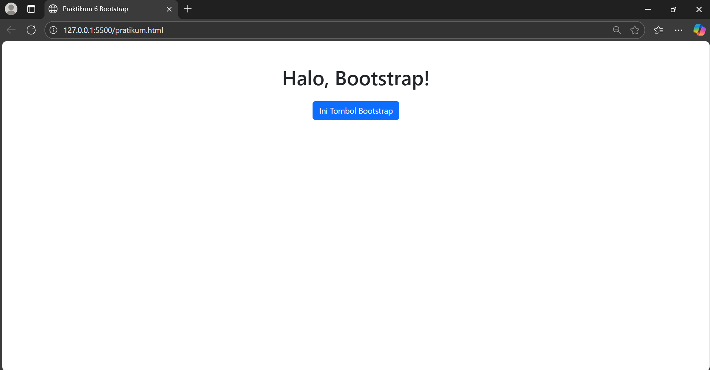
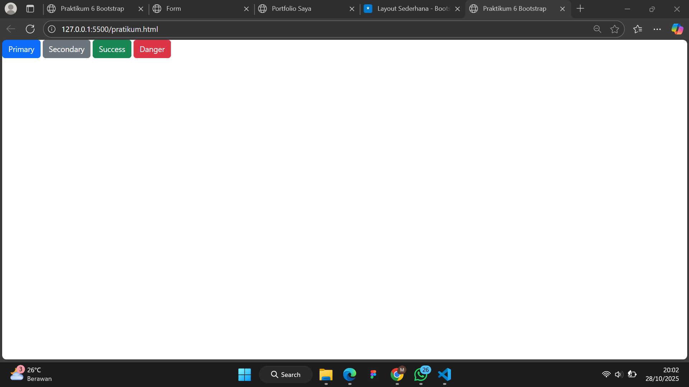
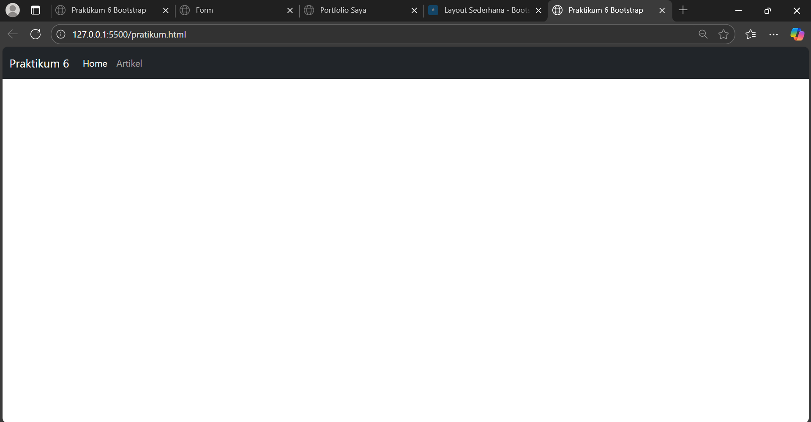
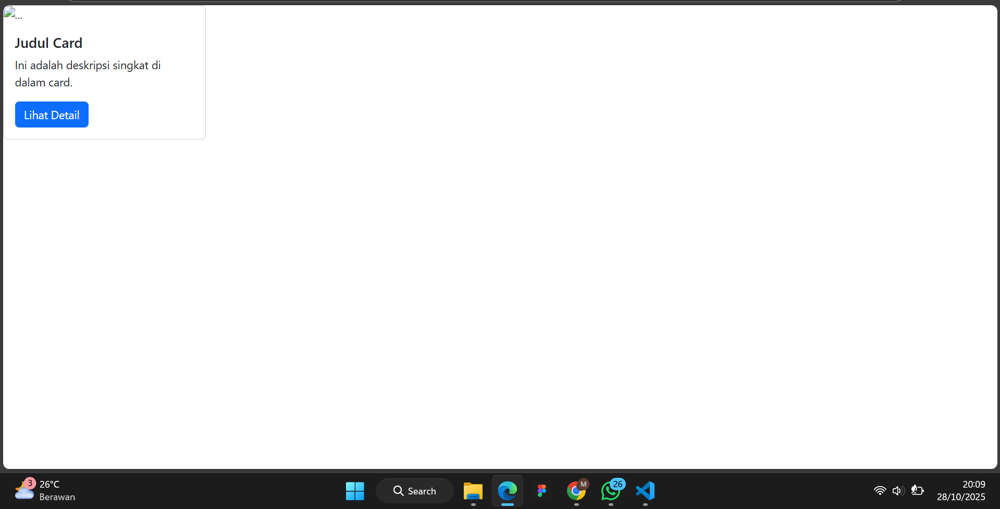
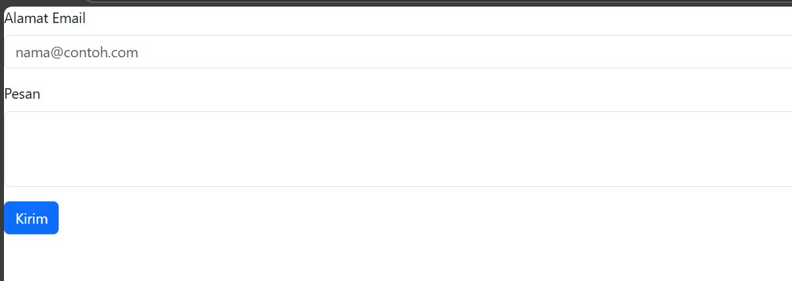
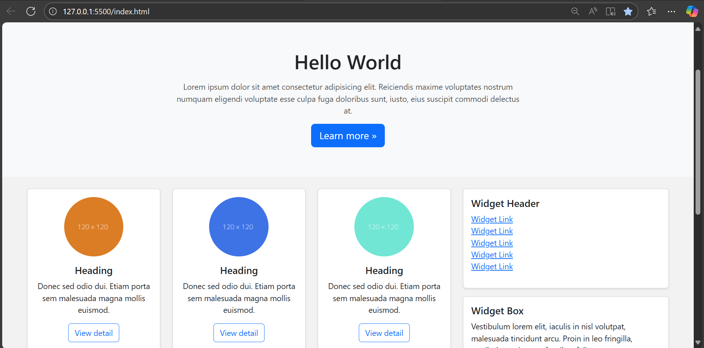
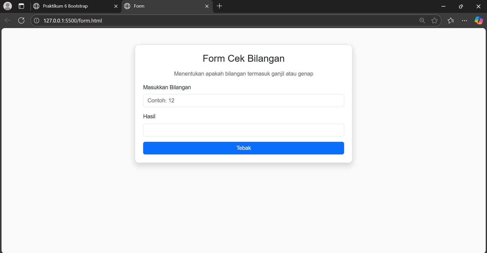
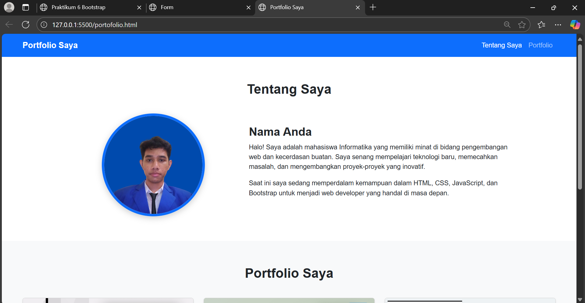

- Nama : Muhamad Nikmal Wahid
- kelas : TI 24 a3
- Pemrograman Web


# Pratikum 6: Web Framework

## Intruksi Praktikum 
- Siapkan Text editor seperti VScode
- Buat file baru
- Buat struktur dasar dari dokumen HTML
- Mengikuti langkah-langkah yang tertera


# Setup Bootstrap (Menggunakan CDN)

```
<!DOCTYPE html>
<html lang="en">
<head>
  <meta charset="UTF-8">
  <meta name="viewport" content="width=device-width, initial-scale=1.0">
  <title>Praktikum 6 Bootstrap</title>
  <link
    href="https://cdn.jsdelivr.net/npm/bootstrap@5.3.3/dist/css/bootstrap.min.css"
    rel="stylesheet"
    integrity="sha384-QWTKZyjpPEjISv5WaRU9OFeRpok6YctnYmDr5pNlyT2bRjXh0JMhjY6hW+ALEwIH"
    crossorigin="anonymous">
</head>
<body>
  <div class="container text-center mt-5">
    <h1>Halo, Bootstrap!</h1>
    <button class="btn btn-primary mt-3">Ini Tombol Bootstrap</button>
  </div>

  <script
    src="https://cdn.jsdelivr.net/npm/bootstrap@5.3.3/dist/js/bootstrap.bundle.min.js"
    integrity="sha384-YvpcrYf0tY3lHB60NNkmXc5s9fDVZLESaAA55NDzOxhy9GkcIdslK1eN7N6jIeHz"
    crossorigin="anonymous"></script>
</body>
</html>
```


# Container 
```
<div class="container">
</div>

<div class="container-fluid">
</div>
```


# Grid Sistem
```
<div class="container">
  <div class="row">
    <div class="col-4">
    </div>
    <div class="col-4">
    </div>
    <div class="col-4">
    </div>
  </div>
</div>
```


# Komponen Button (Tombol)
```
<button class="btn btn-primary">Primary</button>
<button class="btn btn-secondary">Secondary</button>
<button class="btn btn-success">Success</button>
<button class="btn btn-danger">Danger</button>
```


# Komponen Navigasi (Button)
```
<nav class="navbar navbar-expand-lg navbar-dark bg-dark">
  <div class="container-fluid">
    <a class="navbar-brand" href="#">Praktikum 6</a>

    <button class="navbar-toggler" type="button" data-bs-toggle="collapse" data-bs-target="#navbarNav">
      <span class="navbar-toggler-icon"></span>
    </button>

    <div class="collapse navbar-collapse" id="navbarNav">
      <ul class="navbar-nav">
        <li class="nav-item">
          <a class="nav-link active" href="#">Home</a>
        </li>
        <li class="nav-item">
          <a class="nav-link" href="#">Artikel</a>
        </li>
      </ul>
    </div>
  </div>
</nav>
```


# Komponen Card (Kartu) 
```
<div class="card" style="width: 18rem;">
  
  <div class="card-body">
    <h5 class="card-title">Judul Card</h5>
    <p class="card-text">Ini adalah deskripsi singkat di dalam card.</p>
    <a href="#" class="btn btn-primary">Lihat Detail</a>
  </div>
</div>
```


# Komponen Form 
```
<div class="mb-3">
  <label for="emailInput" class="form-label">Alamat Email</label>
  <input type="email" class="form-control" id="emailInput" placeholder="nama@contoh.com">
</div>

<div class="mb-3">
  <label for="pesanText" class="form-label">Pesan</label>
  <textarea class="form-control" id="pesanText" rows="3"></textarea>
</div>

<button type="submit" class="btn btn-primary">Kirim</button>
```



# Pertanyaan dan tugas 
1. Refactor Layout Praktikum 4
   Ambil layout web sederhana dari Praktikum 4. Buat ulang layout tersebut menggunakan
   Bootstrap Grid System.
  - Gunakan <nav> Bootstrap untuk bagian navigasi
  - Gunakan class .row dan .col-md-8 untuk main content dan .col-md-4 untuk sidebar
  - Gunakan komponen .card Bootstrap untuk menggantikan .widget-box
  - Gunakan komponen .card untuk menggantikan .box (bagian "Heading" yang berisi 3 kolom)
  - Anda tidak diperbolehkan menggunakan CSS float atau clear manual.

Code: 
```
<!DOCTYPE html>
<html lang="id">
<head>
  <meta charset="UTF-8">
  <meta name="viewport" content="width=device-width, initial-scale=1.0">
  <title>Layout Sederhana - Bootstrap</title>
  <link href="https://cdn.jsdelivr.net/npm/bootstrap@5.3.3/dist/css/bootstrap.min.css" rel="stylesheet">
  <style>
    body {
      font-family: "Segoe UI", sans-serif;
      background-color: #f2f2f2;
    }
    header {
      background: #333;
      color: white;
      padding: 20px 0;
      text-align: center;
    }
    #hero {
      background: #f8f9fa;
      padding: 60px 20px;
      text-align: center;
    }
    #hero h1 {
      font-size: 2.5rem;
      font-weight: 600;
    }
    #hero p {
      max-width: 700px;
      margin: 15px auto;
      color: #555;
    }
    footer {
      background-color: #333;
      color: #fff;
      text-align: center;
      padding: 15px 0;
      margin-top: 40px;
    }
    .image-circle {
      border-radius: 50%;
    }
    .divider {
      border-top: 2px solid #ccc;
      margin: 30px 0;
    }
    .right-img {
      float: right;
      margin-left: 15px;
    }
  </style>
</head>
<body>

  <header>
    <h1>Layout Sederhana</h1>
  </header>

  <nav class="navbar navbar-expand-lg navbar-dark bg-dark">
    <div class="container">
      <a class="navbar-brand fw-semibold" href="#">Home</a>
      <button class="navbar-toggler" type="button" data-bs-toggle="collapse" data-bs-target="#navbarNav">
        <span class="navbar-toggler-icon"></span>
      </button>
      <div class="collapse navbar-collapse" id="navbarNav">
        <ul class="navbar-nav ms-auto">
          <li class="nav-item"><a class="nav-link active" href="#">Home</a></li>
          <li class="nav-item"><a class="nav-link" href="#">Artikel</a></li>
          <li class="nav-item"><a class="nav-link" href="#">About</a></li>
          <li class="nav-item"><a class="nav-link" href="#">Kontak</a></li>
        </ul>
      </div>
    </div>
  </nav>

  <section id="hero" class="text-center">
    <div class="container">
      <h1>Hello World</h1>
      <p>Lorem ipsum dolor sit amet consectetur adipisicing elit. Reiciendis maxime voluptates nostrum numquam eligendi voluptate esse culpa fuga doloribus sunt, iusto, eius suscipit commodi delectus at.</p>
      <a href="#" class="btn btn-primary btn-lg">Learn more &raquo;</a>
    </div>
  </section>

  <div class="container my-4">
    <div class="row">
      <!-- Main -->
      <div class="col-md-8">
        <!-- 3 Cards -->
        <div class="row text-center">
          <div class="col-md-4 mb-3">
            <div class="card h-100 shadow-sm">
              
              <div class="card-body">
                <h5 class="card-title">Heading</h5>
                <p class="card-text">Donec sed odio dui. Etiam porta sem malesuada magna mollis euismod.</p>
                <a href="#" class="btn btn-outline-primary">View detail</a>
              </div>
            </div>
          </div>
          <div class="col-md-4 mb-3">
            <div class="card h-100 shadow-sm">
              
              <div class="card-body">
                <h5 class="card-title">Heading</h5>
                <p class="card-text">Donec sed odio dui. Etiam porta sem malesuada magna mollis euismod.</p>
                <a href="#" class="btn btn-outline-primary">View detail</a>
              </div>
            </div>
          </div>
          <div class="col-md-4 mb-3">
            <div class="card h-100 shadow-sm">
              
              <div class="card-body">
                <h5 class="card-title">Heading</h5>
                <p class="card-text">Donec sed odio dui. Etiam porta sem malesuada magna mollis euismod.</p>
                <a href="#" class="btn btn-outline-primary">View detail</a>
              </div>
            </div>
          </div>
        </div>

        <hr class="divider">

        <article class="entry mb-4">
          <h2>First featurette heading.</h2>
          
          <p>Lorem ipsum dolor sit amet, consectetur adipiscing elit. Vestibulum lorem elit, iaculis in nisl volutpat, malesuada tincidunt arcu. Proin in leo fringilla, vestibulum mi porta, faucibus felis.</p>
        </article>

        <hr class="divider">

        <article class="entry">
          <h2>Second featurette heading.</h2>
          
          <p>Lorem ipsum dolor sit amet, consectetur adipiscing elit. Vestibulum lorem elit, iaculis in nisl volutpat, malesuada tincidunt arcu. Proin in leo fringilla, vestibulum mi porta, faucibus felis.</p>
        </article>
      </div>

      <div class="col-md-4">
        <div class="card mb-3 shadow-sm">
          <div class="card-body">
            <h5 class="card-title">Widget Header</h5>
            <ul class="list-unstyled">
              <li><a href="#">Widget Link</a></li>
              <li><a href="#">Widget Link</a></li>
              <li><a href="#">Widget Link</a></li>
              <li><a href="#">Widget Link</a></li>
              <li><a href="#">Widget Link</a></li>
            </ul>
          </div>
        </div>
        <div class="card shadow-sm">
          <div class="card-body">
            <h5 class="card-title">Widget Box</h5>
            <p>Vestibulum lorem elit, iaculis in nisl volutpat, malesuada tincidunt arcu. Proin in leo fringilla, vestibulum mi porta, faucibus felis.</p>
          </div>
        </div>
      </div>
    </div>
  </div>

  <footer>
    <p>&copy; 2025 - Universitas Pelita Bangsa</p>
  </footer>

  <script src="https://cdn.jsdelivr.net/npm/bootstrap@5.3.3/dist/js/bootstrap.bundle.min.js"></script>
</body>
</html>
```


## Refaktor Form Praktikum 5 
```
<!DOCTYPE html>
<html lang="id">
<head>
  <meta charset="UTF-8">
  <meta name="viewport" content="width=device-width, initial-scale=1.0">
  <title>Form</title>

  <!-- Bootstrap 5 CSS -->
  <link href="https://cdn.jsdelivr.net/npm/bootstrap@5.3.3/dist/css/bootstrap.min.css" rel="stylesheet">

  <script>
    function test() {
      var val1 = document.kirim.T1.value;
      if (val1 === "") {
        alert("Masukkan angka terlebih dahulu!");
        return;
      }
      if (isNaN(val1)) {
        alert("Input harus berupa angka!");
        return;
      }
      if (val1 % 2 == 0)
        document.kirim.T2.value = "Bilangan Genap";
      else
        document.kirim.T2.value = "Bilangan Ganjil";
    }
  </script>

  <style>
    body {
      background-color: #f8f9fa;
      font-family: "Poppins", sans-serif;
    }
    .card {
      border-radius: 12px;
    }
  </style>
</head>
<body>
  <div class="container py-5">
    <div class="row justify-content-center">
      <div class="col-md-6">
        <div class="card shadow p-4">
          <h3 class="text-center mb-3">Form Cek Bilangan</h3>
          <p class="text-center text-muted">Menentukan apakah bilangan termasuk ganjil atau genap</p>

          <form method="POST" name="kirim">
            <div class="mb-3">
              <label for="T1" class="form-label">Masukkan Bilangan</label>
              <input type="text" class="form-control" name="T1" id="T1" placeholder="Contoh: 12">
            </div>

            <div class="mb-3">
              <label for="T2" class="form-label">Hasil</label>
              <input type="text" class="form-control" name="T2" id="T2" readonly>
            </div>

            <div class="d-grid">
              <button type="button" class="btn btn-primary" name="B1" onclick="test()">Tebak</button>
            </div>
          </form>
        </div>
      </div>
    </div>
  </div>

  <!-- Bootstrap JS -->
  <script src="https://cdn.jsdelivr.net/npm/bootstrap@5.3.3/dist/js/bootstrap.bundle.min.js"></script>
</body>
</html>
```


## Membuat Portfolio Sederhana 
```
<!DOCTYPE html>
<html lang="id">
<head>
  <meta charset="UTF-8">
  <meta name="viewport" content="width=device-width, initial-scale=1.0">
  <title>Portfolio Saya</title>
  <link 
    href="https://cdn.jsdelivr.net/npm/bootstrap@5.3.3/dist/css/bootstrap.min.css" 
    rel="stylesheet">
  <style>
    body {
      font-family: "Poppins", sans-serif;
    }

    /* Bagian foto agar lebih proporsional */
    .profile-pic {
      width: 250px;
      height: 250px;
      object-fit: cover;
      border-radius: 50%;
      border: 6px solid #0d6efd;
      box-shadow: 0 4px 15px rgba(0, 0, 0, 0.2);
    }

    /* Section heading */
    h2.section-title {
      font-weight: 600;
      margin-bottom: 40px;
    }

    /* Spasi antar section */
    section {
      padding: 60px 0;
    }

    footer {
      background-color: #0d6efd;
      color: white;
      padding: 15px 0;
    }

    /* Responsive tweak */
    @media (max-width: 768px) {
      .profile-pic {
        margin-bottom: 20px;
      }
    }
  </style>
</head>
<body>

  <!-- Navbar -->
  <nav class="navbar navbar-expand-lg navbar-dark bg-primary">
    <div class="container">
      <a class="navbar-brand fw-semibold" href="#">Portfolio Saya</a>
      <button class="navbar-toggler" type="button" data-bs-toggle="collapse" data-bs-target="#navbarNav">
        <span class="navbar-toggler-icon"></span>
      </button>
      <div class="collapse navbar-collapse" id="navbarNav">
        <ul class="navbar-nav ms-auto">
          <li class="nav-item"><a class="nav-link active" href="#tentang">Tentang Saya</a></li>
          <li class="nav-item"><a class="nav-link" href="#portfolio">Portfolio</a></li>
        </ul>
      </div>
    </div>
  </nav>

  <!-- Tentang Saya -->
  <section id="tentang">
    <div class="container">
      <h2 class="text-center section-title">Tentang Saya</h2>
      <div class="row align-items-center justify-content-center">
        <!-- Kolom kiri -->
        <div class="col-md-4 text-center">
          
        </div>

        <!-- Kolom kanan -->
        <div class="col-md-6">
          <h3 class="fw-bold">Nama Anda</h3>
          <p>
            Halo! Saya adalah mahasiswa Informatika yang memiliki minat di bidang pengembangan web dan kecerdasan buatan.
            Saya senang mempelajari teknologi baru, memecahkan masalah, dan mengembangkan proyek-proyek yang inovatif.
          </p>
          <p>
            Saat ini saya sedang memperdalam kemampuan dalam HTML, CSS, JavaScript, dan Bootstrap untuk menjadi
            web developer yang handal di masa depan.
          </p>
        </div>
      </div>
    </div>
  </section>

  <!-- Portfolio Saya -->
  <section id="portfolio" class="bg-light">
    <div class="container">
      <h2 class="text-center section-title">Portfolio Saya</h2>
      <div class="row">
        <!-- Card 1 -->
        <div class="col-md-4 mb-4">
          <div class="card shadow-sm h-100">
            
            <div class="card-body">
              <h5 class="card-title">Website Sederhana</h5>
              <p class="card-text">Website pertama saya menggunakan HTML, CSS, dan Bootstrap.</p>
            </div>
          </div>
        </div>

        <!-- Card 2 -->
        <div class="col-md-4 mb-4">
          <div class="card shadow-sm h-100">
            
            <div class="card-body">
              <h5 class="card-title">To-Do List App</h5>
              <p class="card-text">Aplikasi pencatat tugas harian sederhana menggunakan JavaScript.</p>
            </div>
          </div>
        </div>

        <!-- Card 3 -->
        <div class="col-md-4 mb-4">
          <div class="card shadow-sm h-100">
            
            <div class="card-body">
              <h5 class="card-title">Desain UI Portfolio</h5>
              <p class="card-text">Desain halaman portfolio interaktif yang dibuat di Figma.</p>
            </div>
          </div>
        </div>
      </div>
    </div>
  </section>

  <footer class="text-center">
    <p class="mb-0">Muhamad Nikmal Wahid</p>
  </footer>

  <script src="https://cdn.jsdelivr.net/npm/bootstrap@5.3.3/dist/js/bootstrap.bundle.min.js"></script>
</body>
</html>
```



